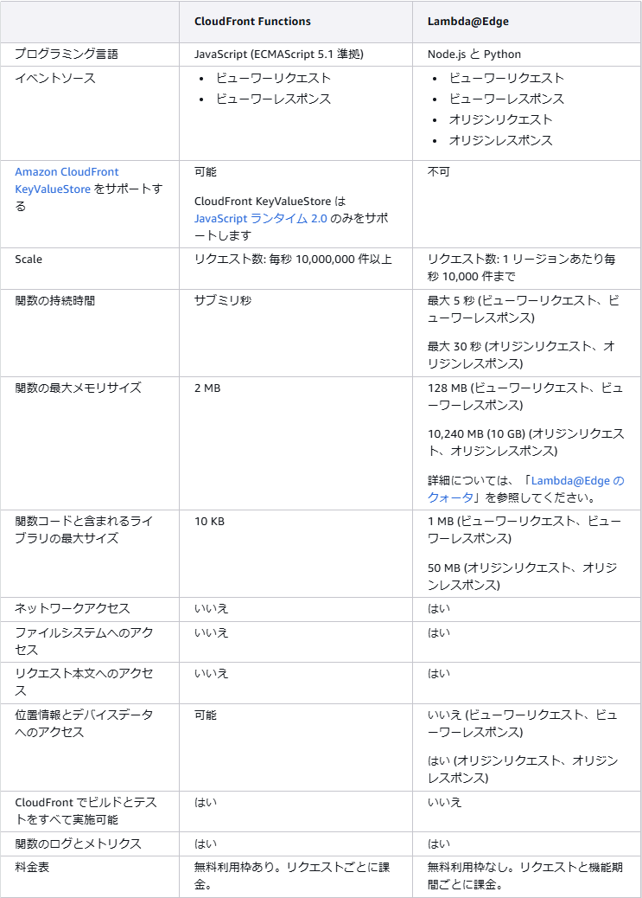

■ **CloudFront FunctionsとLambda@edgeの比較**
# 概要

 - CloudFront Functions と Lambda@edge の性能と料金の比較

## 比較表

引用: https://docs.aws.amazon.com/ja_jp/AmazonCloudFront/latest/DeveloperGuide/edge-functions-choosing.html
※サブミリ秒 = 1ミリ秒以下

### 簡単に

- CloudFront Functions
    - 軽い処理しかできないが大量に捌ける。無料枠もある
    - 関連付けれるイベントソースがビューワー関連だけ
- Lambda@edge
    - 通常の Lambda に比べれば制限は多いが CloudFront Functions に比べると制限は緩い。無料枠はない

## 料金

- CloudFront Functions
    - https://aws.amazon.com/jp/cloudfront/pricing/
        - 100 万件の呼び出しあたり 0.10 USD です (1 回の呼び出しごとに 0.0000001 USD)
        - 100 万回あたり 0.1 USD
        - 無料枠あり（1 か月あたり 200 万件）
- Lambda@edge
    - https://aws.amazon.com/jp/lambda/pricing/
        - リクエスト 1,000,000 件あたり USD 0.60
        - GB-秒あたり USD 0.00005001
        - 100万件あたり USD 0.60
        - 無料枠なし